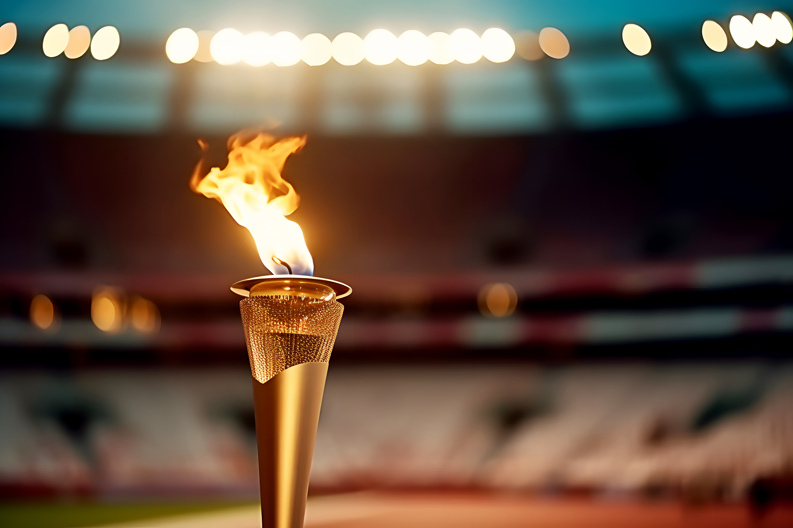

# Olympics-Dataset

This repo contains a comprehensive dataset on summer & winter Olympic athletes & their results between 1896-2022 (will be updated with 2024 results after the upcoming Paris Games)

## Dataset info & collection process

This data comes from [olympedia.org](https://www.olympedia.org/) and was web scraped with the Python Beautiful Soup library (see [scrape_data.py](./scrape_data.py))

- [athletes/bios.csv](./athletes/bios.csv) contains the raw biographical information on each athlete 
- [results/results.csv](./results/results.csv) contains a row-by-row breakdown of each event athletes competed in and their results in that event.

Note, in the process of scraping this dataset, temporary CSV files were created to checkpoint scraping progress. For simplicity these checkpointed files have since been removed from the repository.

## Clean Data

Easier to analyze data can be found in [clean-data/](./clean-data/) folder. In addition to the results and bios info, you can find data files with additional lat/long location data for athletes, NOC region codes, and historic populations of countries over time.

## Streamlit App
Once your application is running, visit the following address in your browser:
Run the Streamlit Application: Run your application using the following command in terminal or command prompt:
streamlit run app_str.py

http://localhost:8501

## Shiny App 
You can see it in both streamlit and shiny applications.

 Note: If you are looking for someone who is hardworking and constantly improving, I am here. :) 

Hinweis: Wenn Sie jemanden suchen, der fleißig ist und sich ständig verbessert, bin ich hier.
